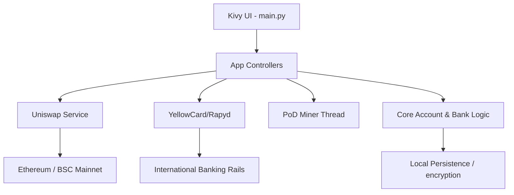

# 💎 XBucks: The Ultimate Decentralized Financial Portal

Welcome to **XBucks**, a production-grade decentralized financial application (DeFi) that merges the convenience of traditional mobile banking (PalmPay style) with the power of blockchain infrastructure.

---

## 🚀 Key Features

| Feature | Provider | Description |
| :--- | :--- | :--- |
| **Global Payouts** |  | Send money to any bank account in the world via IBAN/Swift. |
| **Crypto On/Off Ramp** |  | Seamlessly convert local fiat (NGN) to USDT and vice-versa. |
| **DEX Aggregation** |  | Swap ETH, BTC, and USDT directly within the app. |
| **PoD Mining** |  | Earn rewards via our native Proof-of-Diligence protocol. |
| **High Yield Savings** |  | Lock USDT for 30 days to earn competitive returns. |

---

## 🛠 Project Architecture

The architecture is designed for scalability, separating the high-performance Kivy UI from the complex blockchain and banking service layers.



---

## 🎨 User Experience: PalmPay Refined

XBucks features a premium **PalmPay-inspired** design system optimized for high-speed financial operations:
- **Gradient Sidebar**: Sleek navigation with a signature teal-to-blue transition.
- **Interactive Dashboard**: Real-time balance cards with trend analysis graphs.
- **Micro-Animations**: Smooth screen transitions and instant feedback popups.

---

## 📂 Codebase Navigation

- 📱 [**UI Entry**](file:///c:/Users/USER/Desktop/xbucks/ui/main.py): The main application controller.
- 🎨 [**UI Styles**](file:///c:/Users/USER/Desktop/xbucks/ui/xbucks_style.kv): High-fidelity Kivy styles and layout rules.
- 🌐 [**API Layer**](file:///c:/Users/USER/Desktop/xbucks/external_apis.py): Integration with Rapyd, YellowCard, and Uniswap.
- ⛓️ [**Core Backend**](file:///c:/Users/USER/Desktop/xbucks/bank.py): Local banking and transaction management.

---

## 🚦 Getting Started

1. **Install Dependencies**:
   ```powershell
   pip install kivy web3 requests
   ```
2. **Launch Application**:
   ```powershell
   python ui/main.py
   ```

---

## 📝 Implementation Progress

- [x] **Phase 1**: Core Blockchain Backend (PoD Protocol)
- [x] **Phase 2**: Global Banking Integration (YellowCard/Rapyd)
- [x] **Phase 3**: UI Overhaul (PalmPay Aesthetic)
- [x] **Phase 4**: DEX Integration (Uniswap V3)
- [ ] **Phase 5**: Real-world Card Issuance (Upcoming)

---

> [!IMPORTANT]
> This application is currently in **Production Prototype** mode. API keys are mocked for demonstration. To go live, replace keys in `external_apis.py`.

---

© 2025 XBucks Financial Technologies. All Rights Reserved.
